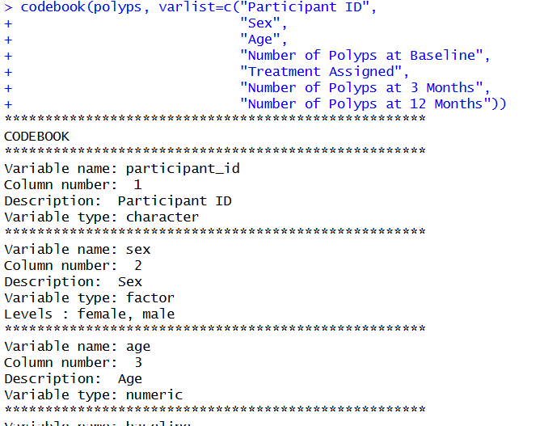

# Codebook-R-function
 R utility to generate an automatic codebook for any data frame — variable names, types, levels, and descriptions.

 

## How to use this function
### 1) Put the following code on the top of your R code
```r
# Codebook function
codebook<-function(data, varlist){
  cat("****************************************************\n")
  cat("CODEBOOK\n")
  for(j in 1:ncol(data)){
    cat("****************************************************\n")
    cat(paste0("Variable name: ", colnames(data)[j]),"\n")
    cat("Column number: ", j, "\n")
    cat("Description: ",varlist[j], "\n")
    cat(paste0("Variable type: ", class(data[,j])),"\n")
    if(class(data[,j])=="factor"){
      cat("Levels : ")
      for(i in 1:c(length(levels(data[,j]))-1)){
        cat(paste0(levels(data[,j])[i],", "))
      }
      cat(paste0(levels(data[,j])[length(levels(data[,j]))],"\n"))
    }
  }
}
```
This code tells R what is doing the codebook function.
### 2) Call the codebook function following this example (adapt it to your own data)
You will need to add the description of your variable in varlist argument following the R synthax.
```r
# Print codebook
codebook(polyps, varlist=c("Participant ID",
                           "Sex",
                           "Age",
                           "Number of Polyps at Baseline",
                           "Treatment Assigned",
                           "Number of Polyps at 3 Months",
                           "Number of Polyps at 12 Months"))
```
If you run this line you should optain a result as below:
```
****************************************************
CODEBOOK
****************************************************
Variable name: participant_id 
Column number:  1 
Description:  Participant ID 
Variable type: character 
****************************************************
Variable name: sex 
Column number:  2 
Description:  Sex 
Variable type: factor 
Levels : female, male
****************************************************
Variable name: age 
Column number:  3 
Description:  Age 
Variable type: numeric 
****************************************************
Variable name: baseline 
Column number:  4 
Description:  Number of Polyps at Baseline 
Variable type: integer 
****************************************************
Variable name: treatment 
Column number:  5 
Description:  Treatment Assigned 
Variable type: factor 
Levels : placebo, sulindac
****************************************************
Variable name: number3m 
Column number:  6 
Description:  Number of Polyps at 3 Months 
Variable type: integer 
****************************************************
Variable name: number12m 
Column number:  7 
Description:  Number of Polyps at 12 Months 
Variable type: numeric
```
Then, you can copy paste the console output to your text editor (ex.: Word):
